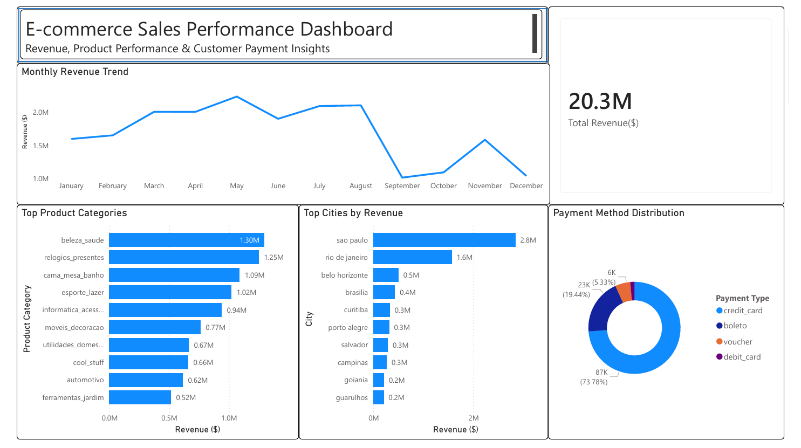

# E-commerce Sales Analysis (SQL + Power BI)

## Project Overview

This project analyzes **100k+ e-commerce transactions** to uncover revenue trends, product performance, and customer purchasing behavior.

Using **SQL (MySQL)**, raw transactional data was imported, cleaned, and transformed to create an analysis-ready dataset. The insights were then visualized using **Power BI** to build an interactive dashboard highlighting key business metrics.

This project simulates a **real-world data analyst workflow**, covering data ingestion, SQL-based analysis, and business intelligence reporting.

---

## Business Questions

This analysis focuses on answering key business questions such as:

- How does **revenue change over time**?
- Which **product categories generate the highest revenue**?
- Which **cities drive the most sales**?
- What are the **most commonly used payment methods**?

---

## Dataset

The dataset used is the **Olist E-commerce Dataset**, containing transactional data from a Brazilian online marketplace.

Key tables used in this project:

- Customers  
- Orders  
- Order Items  
- Payments  
- Products  

Dataset scale:

- ~100k orders  
- ~112k order items  
- ~32k products  
- ~100k payment records  

---

## Tools & Technologies

- **SQL (MySQL)** – Data cleaning, joins, and analytical queries  
- **Power BI** – Data visualization and dashboard development  
- **CSV / Excel** – Data storage and export  

---

## SQL Workflow

The SQL process involved multiple steps:

1. Creating database schema and tables  
2. Importing raw CSV datasets into MySQL  
3. Joining multiple tables to create a unified analysis dataset  
4. Writing analytical queries to calculate business KPIs  

Key SQL concepts used:

- Joins  
- Aggregations  
- Views  
- Data transformation  
- Business KPI analysis  

Example query used in the analysis:

SELECT
product_category_name,
SUM(price) AS revenue
FROM ecommerce_master
GROUP BY product_category_name
ORDER BY revenue DESC;

---

## Power BI Dashboard

The Power BI dashboard visualizes key metrics and trends discovered through SQL analysis.

Key visualizations include:

- Monthly Revenue Trend  
- Top Product Categories by Revenue  
- Top Cities by Revenue  
- Payment Method Distribution  

### Dashboard Preview

---

## Key Insights

Important insights discovered from the analysis:

- **Credit cards account for ~73% of transactions**, making them the dominant payment method.
- **São Paulo generates the highest revenue**, followed by Rio de Janeiro.
- **Beauty & Health is the top-performing product category**, followed by watches and home décor.
- Revenue shows **seasonal fluctuations**, with peaks around **May and August**.

---

## Project Structure

ecommerce-sales-analysis-sql-powerbi  
│  
├── dataset  
│  
├── sql  
│   ├── 01_create_tables.sql  
│   ├── 02_data_import.sql  
│   └── 03_analysis_queries.sql  
│  
├── powerbi  
│   └── ecommerce_sales_dashboard.pbix  
│  
├── dashboard_preview.png  
│  
└── README.md  

---

## Future Improvements

Possible extensions to this project include:

- Customer segmentation analysis  
- Repeat customer analysis  
- Delivery performance analysis  
- Profitability analysis by product category  

---

## Author

**Rohit Bhakta**

Aspiring Data Analyst focused on **SQL, Power BI, and data-driven business insights**

Portfolio:  
https://codebasics.io/portfolio/Rohit-Bhakta
